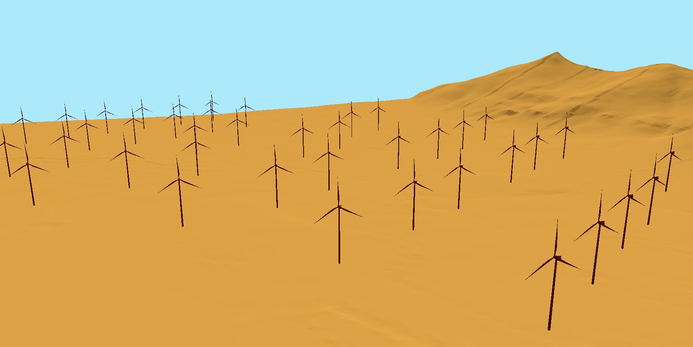

### *geo3D* OpenFOAM configuration files



LoD1 building models (.obj) for renewable wind facility optimisation 

openfoam commands are:
```
blockMesh
surfaceFeatures
surfaceCheck constant/geometry/terrain.obj | tee surfaceCheck_$(date +%Y%m%d_%H%M).log
snappyHexMesh
checkMesh | tee checkMesh_$(date +%Y%m%d_%H%M).log
topoSet
checkMesh | tee checkMesh_$(date +%Y%m%d_%H%M).log
foamRun -solver incompressibleFluid | tee foamRun_$(date +%Y%m%d_%H%M).log
```

A taste of the results (wake field, power curve and power loss) is available in the [turbineSiting.ipynb](https://github.com/AdrianKriger/geo3DopenSim/blob/main/turbineSiting/turbineSiting.ipynb)
