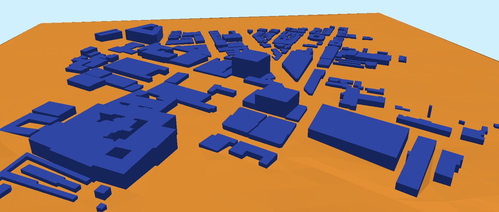

### geo3D OpenFOAM configuration files



LoD1 building models (.obj) for pedestrian wind comfort and de-coupled [UTCI](https://www.utci.org) - ***geo3D***: [urbanFlow-noInternet.ipynb](https://github.com/AdrianKriger/geo3D/blob/main/suburb/urbanFlow-noInternet.ipynb)


```text
openfoam/
├── wStock/
│   ├── rans/
│   │   ├── summer/
│   │   └── winter/
│   └── urans/
│       ├── summer/
│       └── winter/
└── sRiver/
    ├── rans/
    │   ├── summer/
    │   └── winter/
    └── urans/
	├── summer/
	└── winter
```

OpenFOAM simulation results available [here](https://drive.google.com/file/d/1KA8nDcnJ8SjVFzPoleSRsDUZRd8zz1qw/view?usp=share_link)


openfoam commands are:
```

blockMesh

surfaceFeatures

surfaceCheck constant/geometry/buildings.obj | tee surfaceCheck_$(date +%Y%m%d_%H%M).log

snappyHexMesh

checkMesh | tee checkMesh_$(date +%Y%m%d_%H%M).log

foamRun -solver incompressibleFluid | tee foamRun_$(date +%Y%m%d_%H%M).log
```