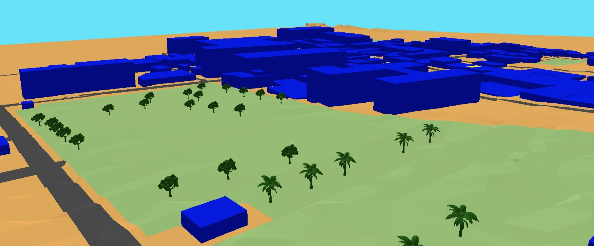

### geo3D OpenFOAM configuration files



LoD1 City Model (terrain, buildings, roads, recreation and trees) for pedestrian wind comfort and de-coupled [UTCI](https://www.utci.org) 

openfoam commands are:
```
surfaceCheck constant/geometry/scene.obj | tee surfaceCheck_$(date +%Y%m%d_%H%M).log
blockMesh
surfaceFeatures
snappyHexMesh | tee snappy_$(date +%Y%m%d_%H%M).log
checkMesh | tee checkMesh_$(date +%Y%m%d_%H%M).log

splitMeshRegions -makeCellZones
subsetMesh -cellSet region0

#- check that executed sucessfully
checkMesh | tee checkMesh_$(date +%Y%m%d_%H%M).log

#- set the porous regions for the trees
topoSet
checkMesh | tee checkMesh_$(date +%Y%m%d_%H%M).log

foamRun -solver incompressibleFluid | tee foamRun_$(date +%Y%m%d_%H%M).log

#- create pedestrianZone.vtk surface. will be in postProcessing folder
foamPostProcess -time 700:
```

A taste of the results are available in the [wStockUTCI.ipynb](https://github.com/AdrianKriger/geo3DopenSim/blob/main/utci/wStockUTCI.ipynb)